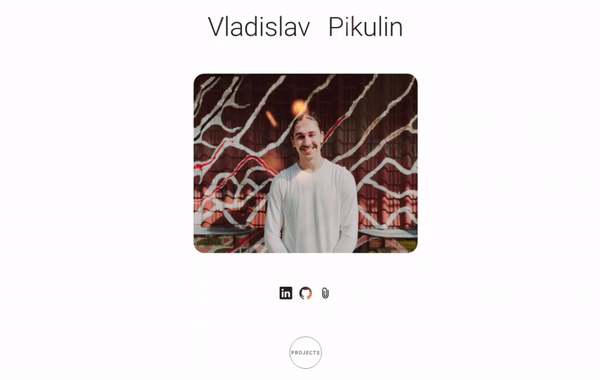

## Hello there, I'm Влад (Vlad)  
 

  <samp>
A Fullstack Developer from  <b>Vladivostok, Russia</b>. Currently living in  <b>Kuala Lumpur, Malaysia</b>.
  </samp>
   
   
  
  

 

### Portfolio Site

  

 
 

## Tools

   
  
  
  
  
  
  
  
  
  
  
  
  
  
  
  
  
  
  
  
  

 
 

## Contact me

  
   
   

------------

  

 
 

---

